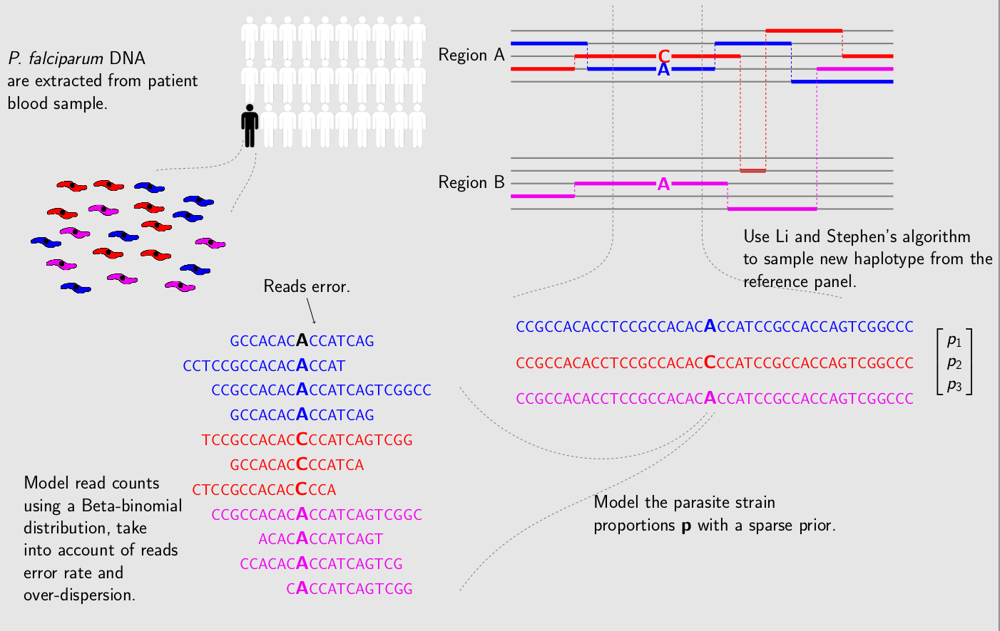

PfDeconv
===========

[](https://circleci.com/gh/mcveanlab/PfDeconv)
[](https://travis-ci.org/mcveanlab/PfDeconv)
[](https://coveralls.io/github/mcveanlab/PfDeconv)

_PfDeconv_ is developed as part of the [_Pf3k_](https://www.malariagen.net/projects/parasite/pf3k) project. The _Pf3k_ project is a global collaboration using the latest sequencing technologies to provide a high-resolution view of natural variation in the malaria parasite Plasmodium falciparum. Parasite DNA were extracted from patient blood sample, which often contains more than one parasite strain, with unknown proportions. _PfDeconv_ is used for deconvoluting mixed haplotypes, and reporting the mixture proportions from each sample.

##METHOD OVERVIEW



##INSTALL
```bash
./bootstrap
make
```

##LICENCE
You can freely use all code in this project under the conditions of the GNU GPL Version 3 or later.

##HOW IT WORKS

Program parameters and options:

Options              | Useage |
:-------------------:| ------------------------------- |
-h or -help          |  Help. List the following content.
            -ref STR |  File path of reference allele count.
            -alt STR |  File path of alternative allele count.
           -plaf STR |  File path of population level allele frequencies.
          -panel STR |  File path of the reference panel.
              -o STR |  Specify the file name prefix of the output.
              -p INT |  Out put precision (default value 8).
              -k INT |  Number of strain (default value 5).
           -seed INT |  Random seed.
        -nSample INT |  Number of MCMC samples.
           -rate INT |  MCMC sample rate.
            -noPanel |  Use population level allele frequency as prior.


###Input files:
Tab-delimited plain text for input. First and second columns record chromosome and position labels respectively. Third columns records the reference allele count, alternative allele count or population level allele frequency.

#### Text file with reference allele count
```
"CHROM"	"POS"	"PG0390.C"
"Pf3D7_01_v3"	93157	85
"Pf3D7_01_v3"	94422	77
"Pf3D7_01_v3"	94459	90
"Pf3D7_01_v3"	94487	79
```

#### Text file with alternative allele count
```
"CHROM"	"POS"	"PG0390.C"
"Pf3D7_01_v3"	93157	0
"Pf3D7_01_v3"	94422	0
"Pf3D7_01_v3"	94459	0
"Pf3D7_01_v3"	94487	0
```

#### Text file with population level alternative allele frequency
```
"CHROM"	"POS"	"PLAF"
"Pf3D7_01_v3"	93157	0.0190612159917058
"Pf3D7_01_v3"	94422	0.135502358766423
"Pf3D7_01_v3"	94459	0.156294363760064
"Pf3D7_01_v3"	94487	0.143439298925837
```

#### Reference panel recorded in CSV format
```
CHROM,POS,threeD7,dd2gt.from.regression,HB3gt.from.regression,sevenG8gt.from.regression
Pf3D7_01_v3,93157,0,0,0,1
Pf3D7_01_v3,94422,0,0,0,1
Pf3D7_01_v3,94459,0,0,0,1
Pf3D7_01_v3,94487,0,0,0,1
```


###Input examples :
```bash
./pfDeconv -ref labStrains/PG0390_first100ref.txt -alt labStrains/PG0390_first100alt.txt -plaf labStrains/labStrains_first100_PLAF.txt -panel labStrains/lab_first100_Panel.txt -o tmp1
./pfDeconv -ref labStrains/PG0390_first100ref.txt -alt labStrains/PG0390_first100alt.txt -plaf labStrains/labStrains_first100_PLAF.txt -panel labStrains/lab_first100_Panel.txt -nSample 100 -rate 3
```


###Output files:
_PfDeconv_ outputs text files with user-specified prefix:

File Name            | Content |
:-------------------:| ------------------------------- |
prefix.log           | Log file records _PfDeconv_ version, input file paths, parameter used and proportion estimates at the final iteration.
prefix.llk           | Log likelihood of the MCMC chain.
prefix.prop          | MCMC updates of the proportion estimates.
prefix.hap           | Haplotypes at the final iteration.

