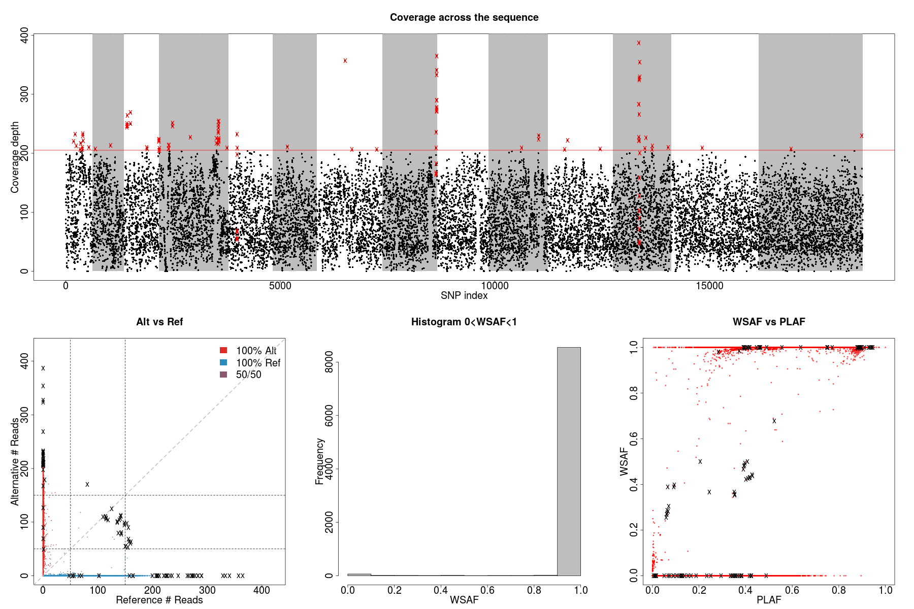
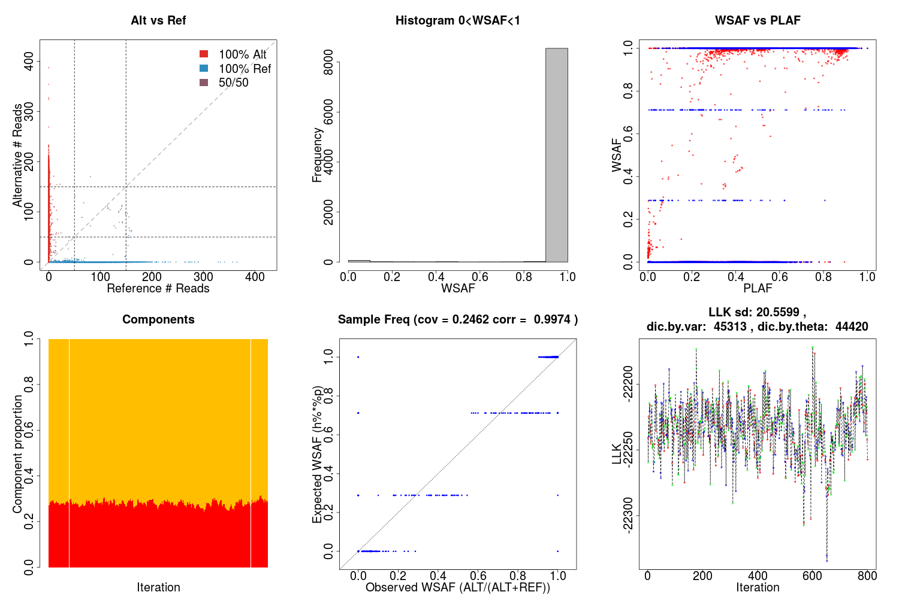
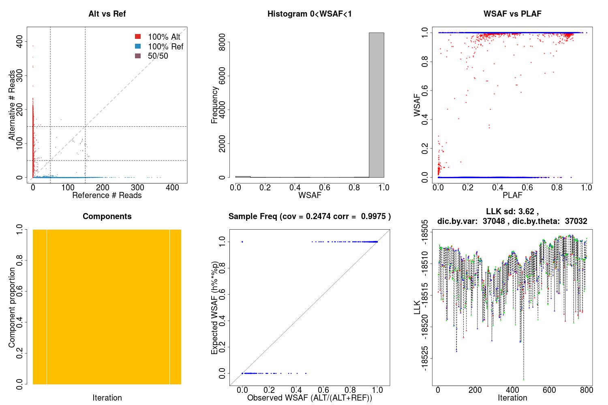

Frequently asked questions
==========================

Data filtering
--------------
Data filtering is an important step for deconvolution.

```bash
utilities/dataExplore.r -vcf data/exampleData/PG0415-C.eg.vcf.gz \
    -plaf data/exampleData/labStrains.eg.PLAF.txt \
    -o PG0415-C
```



We observe a small number of heterozygous sites with high coverage, which can potentially mislead our model to over-fit the data with additional strains

```bash
./dEploid -vcf data/exampleData/PG0415-C.eg.vcf.gz \
    -plaf data/exampleData/labStrains.eg.PLAF.txt \
    -noPanel -o PG0415-CNopanel -seed 2

utilities/interpretDEploid.r -vcf data/exampleData/PG0415-C.eg.vcf.gz \
    -plaf data/exampleData/labStrains.eg.PLAF.txt \
    -dEprefix PG0415-CNopanel \
    -o PG0415-CNopanel

```



After filtering,

```bash
./dEploid -vcf data/exampleData/PG0415-C.eg.vcf.gz \
    -plaf data/exampleData/labStrains.eg.PLAF.txt \
    -noPanel -o PG0415-CNopanel.filtered -seed 2 \
    -exclude PG0415-CPotentialOutliers.txt

utilities/interpretDEploid.r -vcf data/exampleData/PG0415-C.eg.vcf.gz \
    -plaf data/exampleData/labStrains.eg.PLAF.txt \
    -dEprefix PG0415-CNopanel.filtered \
    -o PG0415-CNopanel.filtered \
    -exclude PG0415-CPotentialOutliers.txt
```

