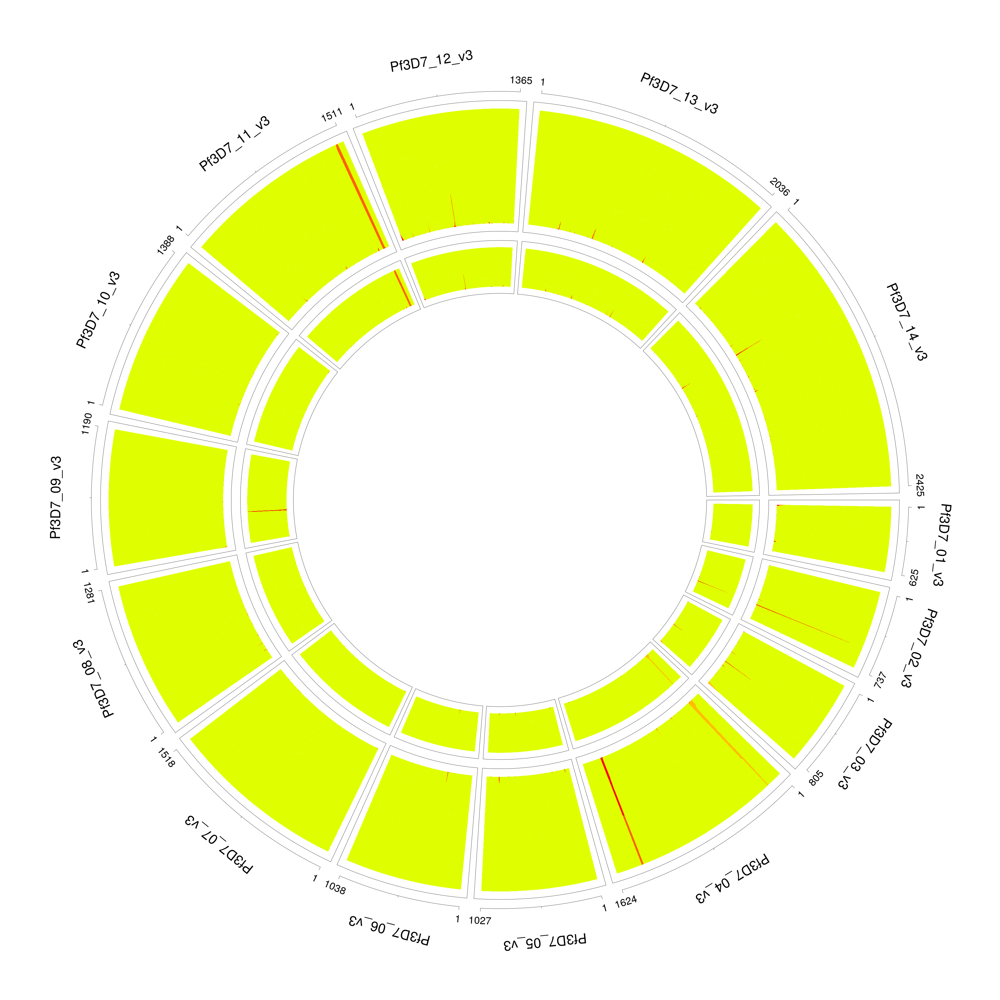
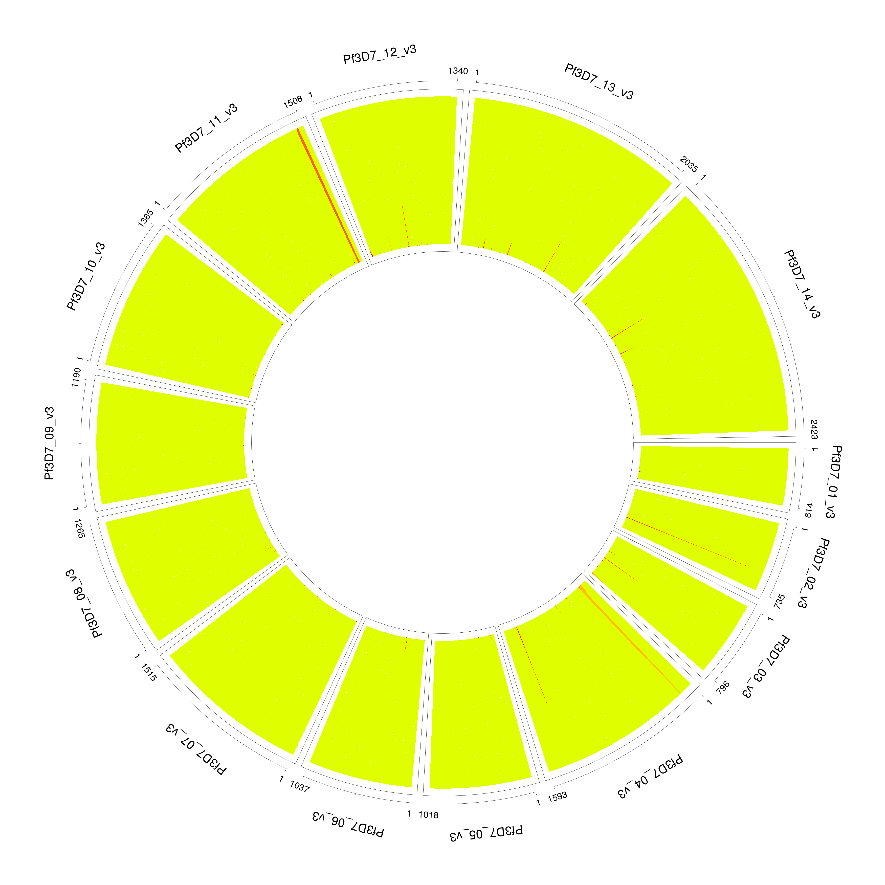
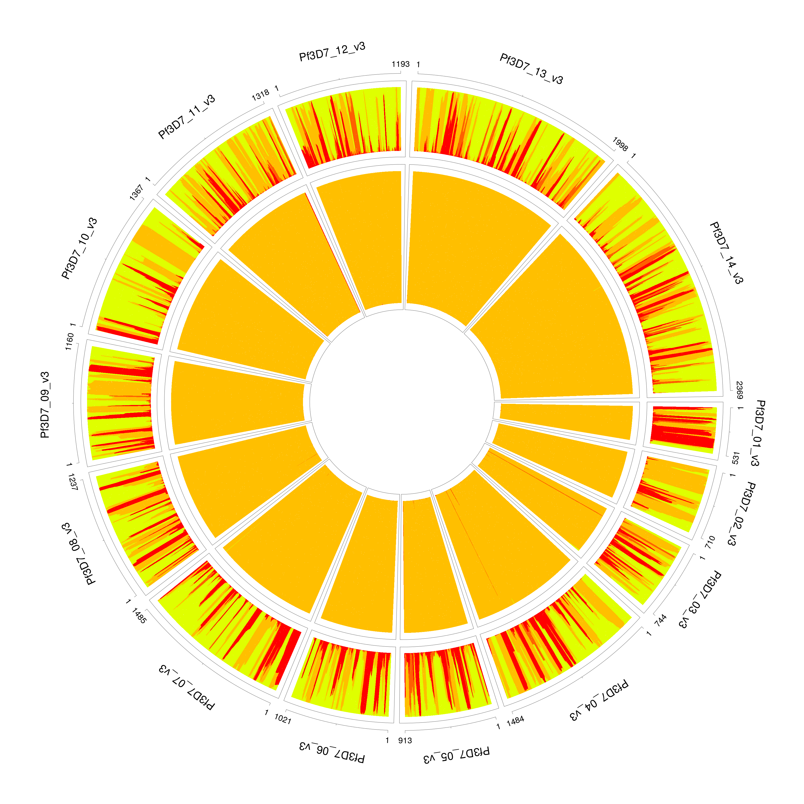

Frequently asked questions
==========================

Data filtering
--------------
Data filtering is an important step for deconvolution.

```bash
utilities/dataExplore.r -vcf data/exampleData/PG0415-C.eg.vcf.gz \
    -plaf data/exampleData/labStrains.eg.PLAF.txt \
    -o PG0415-C
```


We observe a small number of heterozygous sites with high coverage (marked as crosses above), which can potentially mislead our model to over-fit the data with additional strains.

```bash
./dEploid -vcf data/exampleData/PG0415-C.eg.vcf.gz \
    -plaf data/exampleData/labStrains.eg.PLAF.txt \
    -noPanel -o PG0415-CNopanel -seed 2

initialProp=$( cat PG0415-CNopanel.prop | tail -1 | sed -e "s/\t/ /g" )
./dEploid -vcf data/exampleData/PG0415-C.eg.vcf.gz \
    -plaf data/exampleData/labStrains.eg.PLAF.txt \
    -panel data/exampleData/labStrains.eg.panel.txt \
    -o PG0415-CNopanel \
    -initialP ${initialProp} \
    -painting PG0415-CNopanel.hap

utilities/interpretDEploid.r -vcf data/exampleData/PG0415-C.eg.vcf.gz \
    -plaf data/exampleData/labStrains.eg.PLAF.txt \
    -dEprefix PG0415-CNopanel \
    -o PG0415-CNopanel \
    -ring

```


The data exploration utility `utilities/dataExplore.r` identifies a list of potential outliers. After filtering, we correctly identify the number of strains and proportion.

```bash
./dEploid -vcf data/exampleData/PG0415-C.eg.vcf.gz \
    -plaf data/exampleData/labStrains.eg.PLAF.txt \
    -noPanel -o PG0415-CNopanel.filtered -seed 2 \
    -exclude PG0415-CPotentialOutliers.txt

initialProp=$( cat PG0415-CNopanel.filtered.prop | tail -1 | sed -e "s/\t/ /g" )
./dEploid -vcf data/exampleData/PG0415-C.eg.vcf.gz \
    -plaf data/exampleData/labStrains.eg.PLAF.txt \
    -panel data/exampleData/labStrains.eg.panel.txt \
    -exclude PG0415-CPotentialOutliers.txt \
    -o PG0415-CNopanel.filtered \
    -initialP ${initialProp} \
    -painting PG0415-CNopanel.filtered.hap

utilities/interpretDEploid.r -vcf data/exampleData/PG0415-C.eg.vcf.gz \
    -plaf data/exampleData/labStrains.eg.PLAF.txt \
    -dEprefix PG0415-CNopanel.filtered \
    -o PG0415-CNopanel.filtered \
    -exclude PG0415-CPotentialOutliers.txt \
    -ring
```



Over-fitting
------------

For extremely unbalanced samples, DEploid tends to over-fit the minor strain with an additional component. We recommend adjusting the value of sigma for the prior to improve inference. In this example PG0400-C is a mixture of lab strains 7G8 and HB3 with mixing proportions of 95/5%. The parameter sigma takes value of 5 by default, which over fits the minor strain (see [example 1](#PG0400_sigma5)), and with proportions 0.0276862, 0.945509 and 0.0267463. [Example 1](#PG0400_sigma5) paints the deconvolved strains (proportions in increasing order towards the centre) to the reference panel. We resolve the over-fitting issue by rerun this example, and set sigma with value of 10, it correctly infer the proportions as 0.0313755 and 0.968599 (see [example 2](#PG0400_sigma10)). Note that the radius are not in scale with strain proportions.

```bash
./dEploid -vcf data/exampleData/PG0400-C.eg.vcf.gz \
    -plaf data/exampleData/labStrains.eg.PLAF.txt \
    -panel  data/exampleData/labStrains.eg.panel.txt \
    -o PG0400-Csigma5 -seed 2 -sigma 5 \
    -exclude exclude.txt

initialProp=$( cat PG0400-Csigma5.prop | tail -1 | sed -e "s/\t/ /g" )
./dEploid -vcf data/exampleData/PG0400-C.eg.vcf.gz \
    -plaf data/exampleData/labStrains.eg.PLAF.txt \
    -panel data/exampleData/labStrains.eg.panel.txt \
    -exclude exclude.txt \
    -o PG0400-Csigma5 \
    -initialP ${initialProp} \
    -painting PG0400-Csigma5.hap

utilities/interpretDEploid.r -vcf data/exampleData/PG0400-C.eg.vcf.gz \
    -plaf data/exampleData/labStrains.eg.PLAF.txt \
    -dEprefix PG0400-Csigma5 \
    -o PG0400-Csigma5 \
    -exclude exclude.txt \
    -reverseRing -transformP
```
<a name="PG0400_sigma5"></a>


```bash
./dEploid -vcf data/exampleData/PG0400-C.eg.vcf.gz \
    -plaf data/exampleData/labStrains.eg.PLAF.txt \
    -panel  data/exampleData/labStrains.eg.panel.txt \
    -o PG0400-Csigma10 -seed 2 -sigma 10\
    -exclude exclude.txt

initialProp=$( cat PG0400-Csigma10.prop | tail -1 | sed -e "s/\t/ /g" )
./dEploid -vcf data/exampleData/PG0400-C.eg.vcf.gz \
    -plaf data/exampleData/labStrains.eg.PLAF.txt \
    -panel data/exampleData/labStrains.eg.panel.txt \
    -exclude exclude.txt \
    -o PG0400-Csigma10 \
    -initialP ${initialProp} \
    -painting PG0400-Csigma10.hap

utilities/interpretDEploid.r -vcf data/exampleData/PG0400-C.eg.vcf.gz \
    -plaf data/exampleData/labStrains.eg.PLAF.txt \
    -dEprefix PG0400-Csigma10 \
    -o PG0400-Csigma10 \
    -exclude exclude.txt \
    -reverseRing -transformP
```

<a name="PG0400_sigma10"></a>

