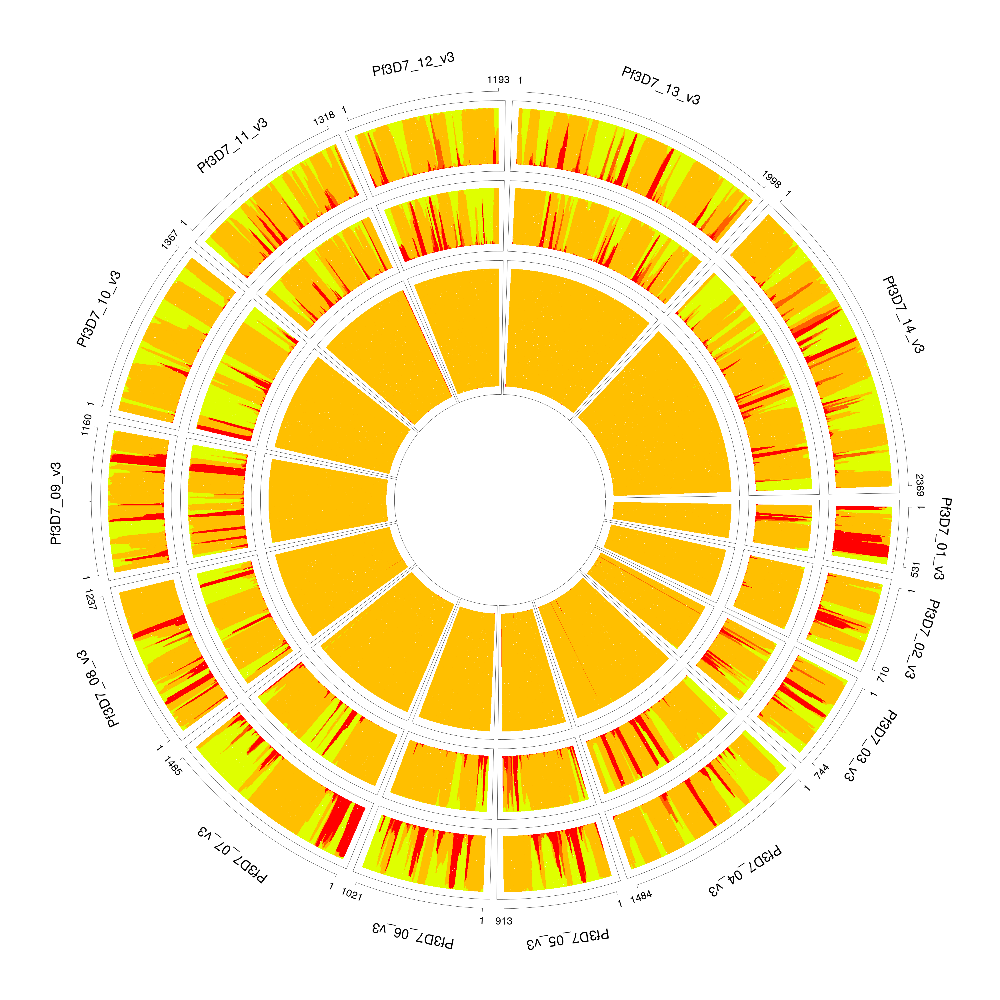

Frequently asked questions
==========================

Where do I get the PLAF? or What PLAF should I use?
---------------------------------------------------

This is probably one of the most frequent questions that I was asked. To answer this question, let me explain "the role of a PLAF file" first.

The PLAF provides a loose genetic structure at the population level.   
In the following example, the first two plots show the number of reference strain allele count on the x-axis for Africa and Asia respectively, and Africa PLAF and Asia PLAF on the y-axis. You can see the points form clouds on the diagonal. However, because the parasite strains from Africa and Asia are vastly different. It is shown in the third figure that PLAF pairs (at the same genome position) are scattered everywhere.  


This is an extreme case to demonstrate how different PLAFs can vary at different geographical regions. PLAF provides prior information for our model to learn the exact structure of the mixed genome. Therefore, it is important to provide appropriate ones.

#### How to manually compute the PLAF?

In Pf3k studies, we use meta data to identify geographical regions of our sample, and divide samples into the following groups to extract the PLAF information.

  1. Malawi, Congo.
  2. Ghana (Navrongo).
  3. Nigeria, Senegal, Mali.
  4. The Gambia, Guinea, Ghana (Kintampo).
  5. Cambodia (Pursat), Cambodia (Pailin), Thailand (Sisakhet).
  6. Vietnam, Laos, Cambodia (Ratanakiri), Cambodia (Preah Vihear).
  7. Bangladesh, Myanmar, Thailand (Mae Sot), Thailand (Ranong).

Since the release of the Pf6 data, I recommand to compute the PLAF in each country.

To compute the PLAF at each site, we simply take the ratio of *the sum of alternative allele of all samples* over *the sum of reference and alternative allele of all samples*. Then aggregate across all sites.

#### Extract PLAF from the VCF file directly

Since DEploid-BestPractice, we offer new DEploid functionality --- extracting PLAF from the VCF file, enabled by the flag `-plafFromVcf`. It will then extract the Allele Frequency (AF) attribute from the INFO field.

NOTE: To archive a good deconvolution result, prior knowledge of an appropriate PLAF or reference haplotypes are important. I would still recommand to go through the manual computation process when possible. 


Data filtering
--------------
Data filtering is an important step for deconvolution.

```bash
utilities/dataExplore.r -vcf data/exampleData/PG0415-C.eg.vcf.gz \
    -plaf data/exampleData/labStrains.eg.PLAF.txt \
    -o PG0415-C
```


We observe a small number of heterozygous sites with high coverage (marked as crosses above), which can potentially mislead our model to over-fit the data with additional strains.

```bash
./dEploid -vcf data/exampleData/PG0415-C.eg.vcf.gz \
    -plaf data/exampleData/labStrains.eg.PLAF.txt \
    -noPanel -o PG0415-CNopanel -seed 2

initialProp=$( cat PG0415-CNopanel.prop | tail -1 | sed -e "s/\t/ /g" )
./dEploid -vcf data/exampleData/PG0415-C.eg.vcf.gz \
    -plaf data/exampleData/labStrains.eg.PLAF.txt \
    -panel data/exampleData/labStrains.eg.panel.txt \
    -o PG0415-CNopanel \
    -initialP ${initialProp} \
    -painting PG0415-CNopanel.hap

utilities/interpretDEploid.r -vcf data/exampleData/PG0415-C.eg.vcf.gz \
    -plaf data/exampleData/labStrains.eg.PLAF.txt \
    -dEprefix PG0415-CNopanel \
    -o PG0415-CNopanel \
    -ring

```


The data exploration utility `utilities/dataExplore.r` identifies a list of potential outliers. After filtering, we correctly identify the number of strains and proportion.

```bash
./dEploid -vcf data/exampleData/PG0415-C.eg.vcf.gz \
    -plaf data/exampleData/labStrains.eg.PLAF.txt \
    -noPanel -o PG0415-CNopanel.filtered -seed 2 \
    -exclude PG0415-CPotentialOutliers.txt

initialProp=$( cat PG0415-CNopanel.filtered.prop | tail -1 | sed -e "s/\t/ /g" )
./dEploid -vcf data/exampleData/PG0415-C.eg.vcf.gz \
    -plaf data/exampleData/labStrains.eg.PLAF.txt \
    -panel data/exampleData/labStrains.eg.panel.txt \
    -exclude PG0415-CPotentialOutliers.txt \
    -o PG0415-CNopanel.filtered \
    -initialP ${initialProp} \
    -painting PG0415-CNopanel.filtered.hap

utilities/interpretDEploid.r -vcf data/exampleData/PG0415-C.eg.vcf.gz \
    -plaf data/exampleData/labStrains.eg.PLAF.txt \
    -dEprefix PG0415-CNopanel.filtered \
    -o PG0415-CNopanel.filtered \
    -exclude PG0415-CPotentialOutliers.txt \
    -ring
```


Over-fitting
------------

For extremely unbalanced samples, DEploid tends to over-fit the minor strain with an additional component. We recommend adjusting the value of sigma for the prior to improve inference. In this example PG0400-C is a mixture of lab strains 7G8 and HB3 with mixing proportions of 95/5%. The parameter sigma takes value of 5 by default, which over fits the minor strain (see [example 1](#PG0400_sigma5)), and with proportions 0.0276862, 0.945509 and 0.0267463. [Example 1](#PG0400_sigma5) paints the deconvolved strains (proportions in increasing order towards the centre) to the reference panel. We resolve the over-fitting issue by rerun this example, and set sigma with value of 10, it correctly infer the proportions as 0.0313755 and 0.968599 (see [example 2](#PG0400_sigma10)). Note that the radius are not in scale with strain proportions.

```bash
./dEploid -vcf data/exampleData/PG0400-C.eg.vcf.gz \
    -plaf data/exampleData/labStrains.eg.PLAF.txt \
    -panel  data/exampleData/labStrains.eg.panel.txt \
    -o PG0400-Csigma5 -seed 2 -sigma 5 \
    -exclude exclude.txt

initialProp=$( cat PG0400-Csigma5.prop | tail -1 | sed -e "s/\t/ /g" )
./dEploid -vcf data/exampleData/PG0400-C.eg.vcf.gz \
    -plaf data/exampleData/labStrains.eg.PLAF.txt \
    -panel data/exampleData/labStrains.eg.panel.txt \
    -exclude exclude.txt \
    -o PG0400-Csigma5 \
    -initialP ${initialProp} \
    -painting PG0400-Csigma5.hap

utilities/interpretDEploid.r -vcf data/exampleData/PG0400-C.eg.vcf.gz \
    -plaf data/exampleData/labStrains.eg.PLAF.txt \
    -dEprefix PG0400-Csigma5 \
    -o PG0400-Csigma5 \
    -exclude exclude.txt \
    -reverseRing -transformP
```
<a name="PG0400_sigma5"></a>


```bash
./dEploid -vcf data/exampleData/PG0400-C.eg.vcf.gz \
    -plaf data/exampleData/labStrains.eg.PLAF.txt \
    -panel  data/exampleData/labStrains.eg.panel.txt \
    -o PG0400-Csigma10 -seed 2 -sigma 10\
    -exclude exclude.txt

initialProp=$( cat PG0400-Csigma10.prop | tail -1 | sed -e "s/\t/ /g" )
./dEploid -vcf data/exampleData/PG0400-C.eg.vcf.gz \
    -plaf data/exampleData/labStrains.eg.PLAF.txt \
    -panel data/exampleData/labStrains.eg.panel.txt \
    -exclude exclude.txt \
    -o PG0400-Csigma10 \
    -initialP ${initialProp} \
    -painting PG0400-Csigma10.hap

utilities/interpretDEploid.r -vcf data/exampleData/PG0400-C.eg.vcf.gz \
    -plaf data/exampleData/labStrains.eg.PLAF.txt \
    -dEprefix PG0400-Csigma10 \
    -o PG0400-Csigma10 \
    -exclude exclude.txt \
    -reverseRing -transformP
```

<a name="PG0400_sigma10"></a>


Benchmark
---------

Please refer to our paper [Zhu et.al (2017)](https://academic.oup.com/bioinformatics/advance-article/doi/10.1093/bioinformatics/btx530/4091117) section [3 Validation and performance](https://academic.oup.com/bioinformatics/advance-article/doi/10.1093/bioinformatics/btx530/4091117#96977811) for benchmarking inference results on number of strains, proportions and haplotype quality.

For the enhanced version -- DEploid-IBD, we compared our results against [Zhu et.al (2017)](https://academic.oup.com/bioinformatics/advance-article/doi/10.1093/bioinformatics/btx530/4091117), and conducted more experiments and validations [Zhu et.al (2019)](https://elifesciences.org/articles/40845#s2).
