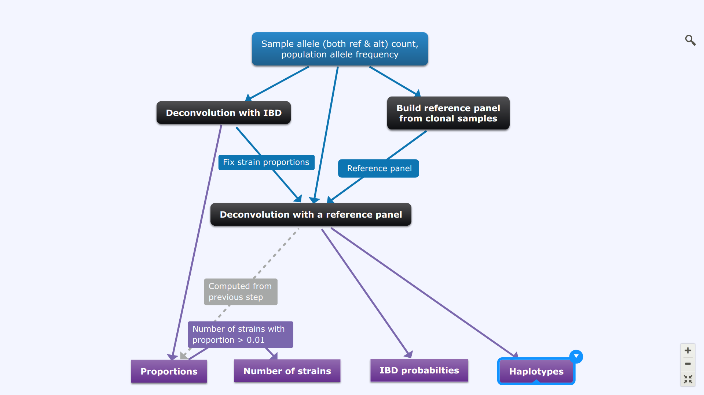

Pf3k workflow
=============

Our main work flow consist with three steps:

  0. Use `dEploid` on clonal samples, and build a reference panel.
  1. Use the IBD method to infer the proportions without a reference panel.
  2. Tune the haplotype with the given reference panel with fixed strain proportions

Black boxes indicate the key deconvolution steps when our program DEploid is used. Boxes in blue and purple represent the input and output respectively at each step. Steps **Deconvolution with IBD** and **Deconvolution with a reference panel** can be combined by using the flag `-ibd`.

[//]: # ( Caveat: need to run the program multiple times, because some models are harder than the others.)

