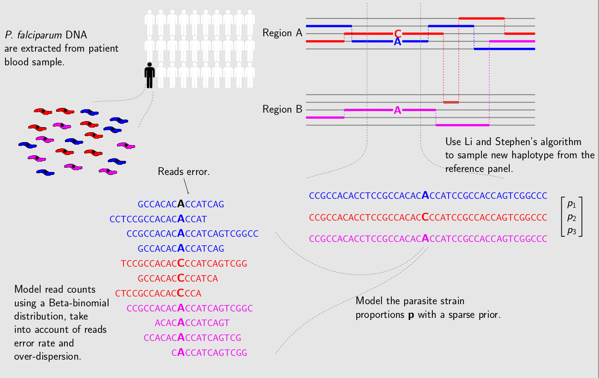

.. _sec-description:

===========
Description
===========

``dEploid`` is designed for deconvoluting mixed genomes with unknown proportions. Traditional 'phasing' programs are limited to diploid organisms. Our method modifies Li and Stephen’s [Li2003]_ algorithm with Markov chain Monte Carlo (MCMC) approaches, and builds a generic framework that allows haloptype searches in a multiple infection setting.

``dEploid`` is primarily developed as part of the `Pf3k <https://www.malariagen.net/projects/parasite/pf3k>`_ project, from which this documentation will take examples from for demonstration. The Pf3k project is a global collaboration using the latest sequencing technologies to provide a high-resolution view of natural variation in the malaria parasite *Plasmodium falciparum*. Parasite DNA are extracted from patient blood sample, which often contains more than one parasite strain, with unknown proportions. ``DEploid`` is used for deconvoluting mixed haplotypes, and reporting the mixture proportions from each sample.

.. ***************
.. Method Overview
.. ***************

.. [Li2003] Li, N. and M. Stephens (2003). Modeling linkage disequilibrium and identifying recombination hotspots using single-nucleotide polymorphism data. *Genetics* 165(4), 2213–2233.
