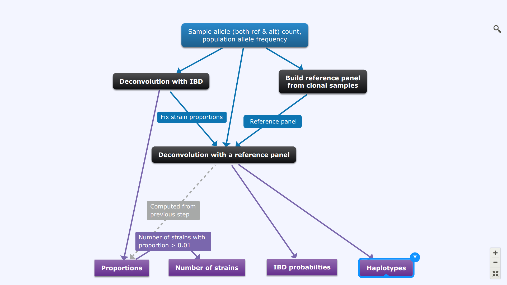

.. _sec-description:

========================
Description and workflow
========================

``dEploid`` is designed for deconvoluting mixed genomes with unknown proportions. Traditional 'phasing' programs are limited to diploid organisms. Our method modifies Li and Stephen’s [Li2003]_ algorithm with Markov chain Monte Carlo (MCMC) approaches, and builds a generic framework that allows haplotype searches in a multiple infection setting.

``dEploid`` is primarily developed as part of the `Pf3k <https://www.malariagen.net/projects/parasite/pf3k>`_ project, from which this documentation will take examples from for demonstration. The Pf3k project is a global collaboration using the latest sequencing technologies to provide a high-resolution view of natural variation in the malaria parasite *Plasmodium falciparum*. Parasite DNA are extracted from patient blood sample, which often contains more than one parasite strain, with unknown proportions. ``DEploid`` is used for deconvoluting mixed haplotypes, and reporting the mixture proportions from each sample.

.. image:: _static/mixedInfection.png
   :width: 1024px
   :alt: An illustration of mixed infection in malaria

*****************************
DEploid-Bestpractice workflow
*****************************

Enabled by the flag `-best`, Similar to the first version, the main workflow consist with two steps:

  1. Use `dEploid` on clonal samples, and build a reference panel.
  2. For the mixed samples, infer both proportions and haplotypes at the same time with the reference panel provided.

The following key actions are now hidden internally in step 2:

  a. Use high-quality sites and reference panel to learn the number of strains (k) in malaria mixed infection
  b. Fix k, infer strain proportion and within sample relatedness
  c. Fix k and proportion, use a lasso algorithm to select the effective reference panel.

Most of the parameters (set to default) have now been tuned (see `DEploid-Bestpractices-github-actions <https://github.com/DEploid-dev/DEploid-Bestpractices-github-actions>`_ for details).

**************************************
DEploid-LASSO workflow (third version)
**************************************

This version aims to improve the haplotype inference with reference panel of any size. It was quickly converted into the Best Practice workflow.

**************************************
DEploid-IBD workflow (second version)
**************************************

The previous workflow struggle for samples with high within-host relatedness. Hence we introduced new procedures and workflow:

  1. Use `dEploid` on clonal samples, and build a reference panel.
  2. Use the IBD method to infer the proportions without a reference panel.
  3. Tune the haplotype with the given reference panel with fixed strain proportions

Black boxes indicate the key deconvolution steps when our program DEploid is used. Boxes in blue and purple represent the input and output respectively at each step. Steps **Deconvolution with IBD** and **Deconvolution with a reference panel** can be combined by using the flag `-ibd`.

*Caveat: need to run the program multiple times, because some models are harder than the others.*

********************************
DEploid workflow (first version)
********************************

Our main workflow consist with two steps:

  1. Use `dEploid` on clonal samples, and build a reference panel.
  2. For the mixed samples, infer both proportions and haplotypes at the same time with the reference panel provided.

*Caveat: need to run the program multiple times, because some models are harder than the others.*

.. [Li2003] Li, N. and M. Stephens (2003). Modeling linkage disequilibrium and identifying recombination hotspots using single-nucleotide polymorphism data. *Genetics* 165(4), 2213–2233.
