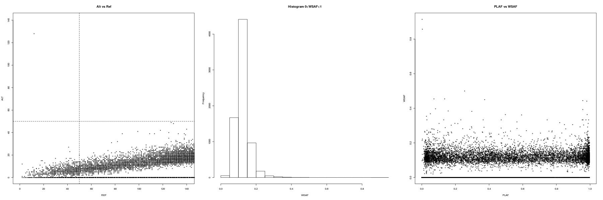

.. _sec-input:

=============
How it works?
=============

******************************
Program parameters and options
******************************

Mostly used
-----------

-vcf [*file*]
    File path of the isolate vcf.

-plaf [*file*]
    File path of population level allele frequencies. Text file with population level alternative allele frequency, for example

.. csv-table::
    :header: CHROM, POS, PLAF
    :widths: 1,1,1

    Pf3D7_01_v3,93157,0.0190612159917058
    Pf3D7_01_v3,94422,0.135502358766423
    Pf3D7_01_v3,94459,0.156294363760064
    Pf3D7_01_v3,94487,0.143439298925837

-panel [*file*]
    File path of the reference panel. Reference panel recorded in CSV format, for example

.. csv-table::
   :header: CHROM, POS, 3D7, Dd2, Hb3, 7G8
   :widths: 15, 10, 5, 5, 5, 5

    Pf3D7_01_v3,93157,0,0,0,1
    Pf3D7_01_v3,94422,0,0,0,1
    Pf3D7_01_v3,94459,0,0,0,1
    Pf3D7_01_v3,94487,0,0,0,1

-noPanel\
    Use population level allele frequency as prior.

.. warning::
    Flags **-panel** and **-noPanel** should not be used together.

-exclude [file]
    File path of sites to be excluded.

-o [string]
    Specify the file name prefix of the output.

-k [int]
    Number of strain (default value 5).

-seed [int]
    Random seed.

-nSample [int]
    Number of MCMC samples (default value 800).

-rate [int]
    MCMC sample rate (default value 5).

-burn [float]
    MCMC

-h , -help
    Help.

-v , -version
    DEploid version.

-vcfOut\
    Save final halpotypes into a VCF file.

You may also try
----------------

-ref [file] -alt [file]
    File path of reference and alternative allele count.

.. note::
    In early ``dEploid`` versions (prior to `v0.2-release`), allele counts extracted from the vcf file are placed in two files, and parsed by flags **-ref [file]** and **-alt [file]**. Tab-delimited plain text for input. First and second columns record chromosome and position labels respectively.  Third columns records the reference allele count or alternative allele count. For example,

.. csv-table:: Reference allele count
    :header: CHROM, POS, PG0390.C
    :widths: 1,1,1

    Pf3D7_01_v3,93157,85
    Pf3D7_01_v3,94422,77
    Pf3D7_01_v3,94459,90
    Pf3D7_01_v3,94487,79

.. csv-table:: Alternative allele count
    :header: CHROM, POS, PG0390.C
    :widths: 1,1,1

    Pf3D7_01_v3,93157,0
    Pf3D7_01_v3,94422,0
    Pf3D7_01_v3,94459,0
    Pf3D7_01_v3,94487,0

.. warning::
    Flags **-ref** and **-alt** should not be used with **-vcf**.

-forbidUpdateProp\
    Forbid MCMC moves to update proportions.

-forbidUpdateSingle\
    Forbid MCMC moves to update single haplotype.

-forbidUpdatePair\
    Forbid MCMC moves to update pair haplotypes.

-exportPostProb\
    Save the posterior probabilities of the final iteration of all strains.

-miss [float]
    Miss copying probability

-recomb [float]
    Constant recombination probability

-initialP [float ...]
    Initialize proportions.

-p [int]
    Output precision (default value 8).

****************
Data exploration
****************

Use our data exploration tools to investigate the data.

::

    $ R --slave "--args -vcf tests/testData/PG0389-C.vcf
     -plaf tests/testData/labStrains_samples_PLAF.txt
     -o PG0389-C " < utilities/dataExplore.r

.. todo::
    Explain a bit more.

.. note::
    The population level allele frequencies can be extracted from simple scripting.
