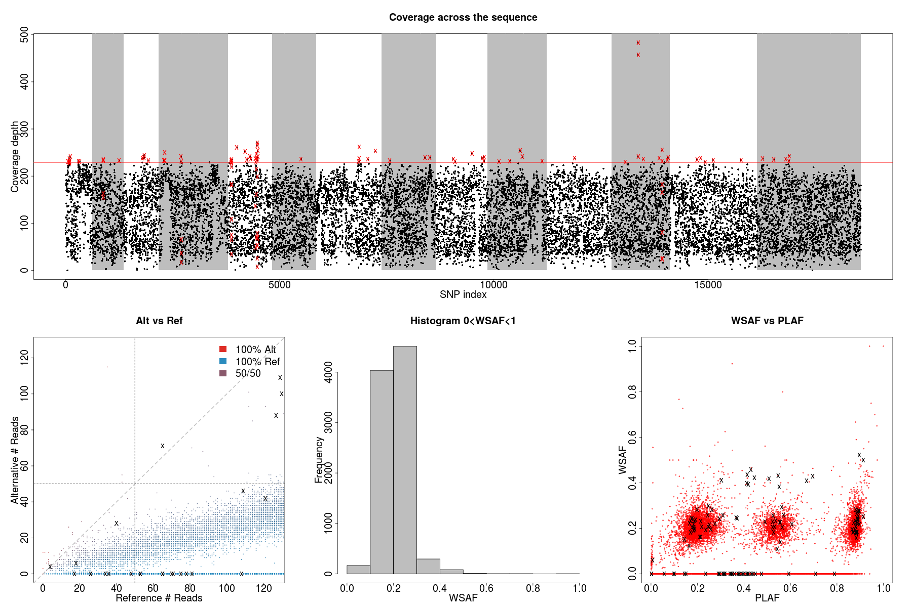

.. _sec-input:

=============
How it works?
=============

******************************
Program parameters and options
******************************

Mostly used
-----------

-best\
    To enable the BestPractice.

-vcf [*file*]
    File path of the isolate vcf. Assume all variants are ``PASS`` in the ``QUAL`` column, the VCF file also reqires the ``AD`` field.

-sample [*sample ID*]
    Sample ID.

-plafFromVcf\
    Extract allele frequency information for the VCF file.

.. note::
    If sample is unspecified, ``dEploid`` only take the first sample in the VCF file.
    ``DEploid`` DO NOT handle multi-allelic variants, nor indels. The ``FILTER`` column will not be used.

-panel [*file*]
    File path of the reference panel (tab-delimited plain text file), for example

.. csv-table::
   :header: CHROM, POS, 3D7, Dd2, Hb3, 7G8
   :widths: 15, 10, 5, 5, 5, 5

    Pf3D7_01_v3,93157,0,0,0,1
    Pf3D7_01_v3,94422,0,0,0,1
    Pf3D7_01_v3,94459,0,0,0,1
    Pf3D7_01_v3,94487,0,0,0,1

-exclude [file]
    File path of sites to be excluded (tab-delimited plain text file).

-o [string]
    Specify the file name prefix of the output.

-k [int]
    Number of strain (default value 5).

-seed [int]
    Random seed.

-nSample [int]
    Number of MCMC samples (default value 800).

-rate [int]
    MCMC sample rate (default value 5).

-burn [float]
    MCMC burn rate (default value 0.5).

-ibd\
    Use IBD segment to infer the proportion, then infer the haplotype (see `Pf3k work-flow <Pf3k-workflow.html#pf3k-workflow>`_  for more details).

-painting [*file*]
    Paint the posterior probability of the given haplotypes.

-inbreeding\
    Calculate the inbreeding probabilities.

-initialP [float ...]
    Initialize proportions.

-ibdPainting\
    IBD painting, compute posterior probabilities of IBD configurations of given strain proportions. This option must be used with flags `-initialP`.

-h , -help
    Help.

-v , -version
    DEploid version.

-vcfOut\
    Save final halpotypes into a VCF file.

You may also try
----------------

-ref [file]
    File path of reference allele count (tab-delimited plain text file).

.. note::
    In early ``dEploid`` versions (prior to `v0.2-release`), allele counts extracted from the vcf file are placed in two files, and parsed by flags **-ref [file]** and **-alt [file]**. Tab-delimited plain text for input. First and second columns record chromosome and position labels respectively.  Third columns records the reference allele count or alternative allele count. For example,

.. csv-table:: Reference allele count
    :header: CHROM, POS, PG0390.C
    :widths: 1,1,1

    Pf3D7_01_v3,93157,85
    Pf3D7_01_v3,94422,77
    Pf3D7_01_v3,94459,90
    Pf3D7_01_v3,94487,79

-alt [file]
    File path of alternative allele count (tab-delimited plain text file).

.. csv-table:: Alternative allele count
    :header: CHROM, POS, PG0390.C
    :widths: 1,1,1

    Pf3D7_01_v3,93157,0
    Pf3D7_01_v3,94422,0
    Pf3D7_01_v3,94459,0
    Pf3D7_01_v3,94487,0

.. warning::
    Flags **-ref** and **-alt** should not be used with **-vcf**.

-plaf [*file*]
    File path of population level allele frequencies (tab-delimited plain text file), for example

.. csv-table::
    :header: CHROM, POS, PLAF
    :widths: 1,1,1

    Pf3D7_01_v3,93157,0.0190612159917058
    Pf3D7_01_v3,94422,0.135502358766423
    Pf3D7_01_v3,94459,0.156294363760064
    Pf3D7_01_v3,94487,0.143439298925837

-noPanel\
    Use population level allele frequency as prior.

.. warning::
    Flags **-panel** and **-noPanel** should not be used together.

-forbidUpdateProp\
    Forbid MCMC moves to update proportions.

-forbidUpdateSingle\
    Forbid MCMC moves to update single haplotype.

-forbidUpdatePair\
    Forbid MCMC moves to update pair haplotypes.

-exportPostProb\
    Save the posterior probabilities of the final iteration of all strains.

-miss [float]
    Miss copying probability.

-recomb [float]
    Constant recombination probability.

-p [int]
    Output precision (default value 8).

-c [float]
    Specify scaling parameter c, which reflects how much data is available (default value 100.0).

-G [float]
    Specify scaling parameter for genetic map (default value of 20.0).

-sigma [float]
    Specify the variance parameter for proportion estimation (default value of 5.0).

-ibdSigma [flat]
    Specify the variance parameter for proportion estimation when IBD method is used (default value of 20.0).

-initialHap [file]
    Specify initial haplotypes of deconvolution.

R utilities
-----------

Flags **-vcf**, **-plaf**, **-ref**, **-alt**, **-exclude**, **-o** usage are the same as ``DEploid``. Additionally, we have the following flags:

-dEprefix [string]
    Prefix of ``DEploid`` output.

-inbreeding\
    Painting haplotype inbreeding posterior probabilities.

-ADFieldIndex\
    The index of ``AD`` field (2 by default).

-filter.threshold [float]
    Filtering threshold (0.995 by default).

-filter.window [int]
    Filtering window (10 by default).

-pdf\
    Produce figures in pdf rather than png.

-ibd\
    Produce figures for IBD process.

-ring\
    Produce circular genome plots for WSAF and haplotype posterior painting probabilities.

.. _sec-eg:

***************************
Example of data exploration
***************************

Use our data exploration tools to investigate the data.

::

    $ utilities/dataExplore.r -vcf data/exampleData/PG0390-C.eg.vcf.gz \
     -plaf data/exampleData/labStrains.eg.PLAF.txt \
     -o PG0390-C

- Figure on the top plot total allele counts across all markers. We use the threshold (red line) to identify markers with extremely high allele counts. Red crosses indicate markers that are filtered out.
- Figure on the left plots the alternative allele count against the reference allele count. As *P. falciparum* genomes are haploid, in clonal samples, one woule expect to see either alternative or reference allele at any sites. Heterozygous sites are indications of mixed infection.
- Figure in the middle is the histogram of the allele frequency within sample. Note that we exclude markers with WSAF strictly equal to 0s and 1s in the histogram.
- Figure on the right show allele frequency within sample, compare against the population average.

.. .. note::
..     The population level allele frequencies can be extracted from simple scripting.
