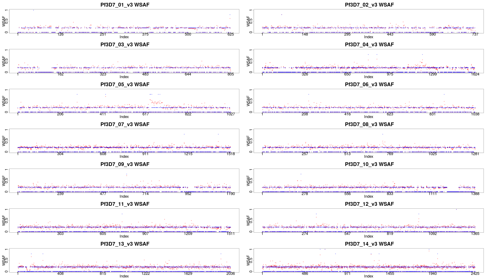

.. _sec-output:

==========================
Making sense of the output
==========================

************
Output files
************

``dEploid`` outputs text files with user-specified prefix with flag **-o**.

*prefix*.log
    Log file records ``dEploid`` version, input file paths, parameter used and proportion estimates at the final iteration.

*prefix*.llk
    Log likelihood of the MCMC chain.

*prefix*.prop
    MCMC updates of the proportion estimates.

*prefix*.hap
    Haplotypes at the final iteration in plain text file.

*prefix*.vcf
    When flag ``-vcfOut`` is turned on, haplotypes are saved at the final iteration in VCF format.

*prefix*.single[i]
    When flag ``-exportPostProb`` is turned on, posterior probabilities of the final iteration of strain [i].

******************************
Example of output interpretion
******************************

Example 1. Standard deconvolution output
****************************************

::

    $ ./dEploid -vcf data/exampleData/PG0390-C.eg.vcf.gz \
    -plaf data/exampleData/labStrains.eg.PLAF.txt \
    -noPanel -o PG0390-CNopanel -seed 1
    $ utilities/interpretDEploid.r -vcf data/exampleData/PG0390-C.eg.vcf.gz \
    -plaf data/exampleData/labStrains.eg.PLAF.txt \
    -dEprefix PG0390-CNopanel \
    -o PG0390-CNopanel -ring

.. image:: _static/PG0390-CNopanel.interpretDEploidFigure.1.png
   :width: 1024px
   :alt: interpretDEploidFigure.1

The top three figures are the same as figures show in :ref:`data example <sec-eg>`, with a small addition of inferred WSAF marked in blue, in the top right figure.

- The bottom left figure show the relative proportion change history of the MCMC chain.
- The middle figure show the correlation between the expected and observed allele frequency in sample.
- The right figure shows changes in MCMC likelihood .

This panel figure shows all allele frequencies within sample across all 14 chromosomes. Expected and observed WSAF are marked in blue and red respectively.

Example 2. Haplotype painting from a given panel
************************************************

``dEploid`` can take its output haplotypes, and calculate the posterior probability of each deconvoluted strain with the reference panel. In this example, the reference panel includes four lab strains: 3D7 (red), Dd2 (dark orange), HB3 (orange) and 7G8 (yellow).

::

    $ ./dEploid -vcf data/exampleData/PG0390-C.eg.vcf.gz \
    -plaf data/exampleData/labStrains.eg.PLAF.txt \
    -panel data/exampleData/labStrains.eg.panel.txt \
    -o PG0390-CPanel -seed 1 -k 3
    $ ./dEploid -vcf data/exampleData/PG0390-C.eg.vcf.gz \
    -plaf data/exampleData/labStrains.eg.PLAF.txt \
    -panel data/exampleData/labStrains.eg.panel.txt \
    -o PG0390-CPanel \
    -painting PG0390-CPanel.hap \
    -initialP 0.8 0 0.2 -k 3
    $ utilities/interpretDEploid.r -vcf data/exampleData/PG0390-C.eg.vcf.gz \
    -plaf data/exampleData/labStrains.eg.PLAF.txt \
    -dEprefix PG0390-CPanel \
    -o PG0390-CPanel -ring

.. image:: _static/PG0390-CPanel.ring.png
   :width: 1024px
   :alt: PG0390fwdBwdRing

Example 3. Deconvolution followed by IBD painting
*************************************************

In addition to lab mixed samples, here we show example of ``dEploid`` deconvolute field sample PD0577-C.

.. image:: _static/PD0577-CPanel.IBD.ring.png
   :width: 1024px
   :alt: PD0577inbreeding
